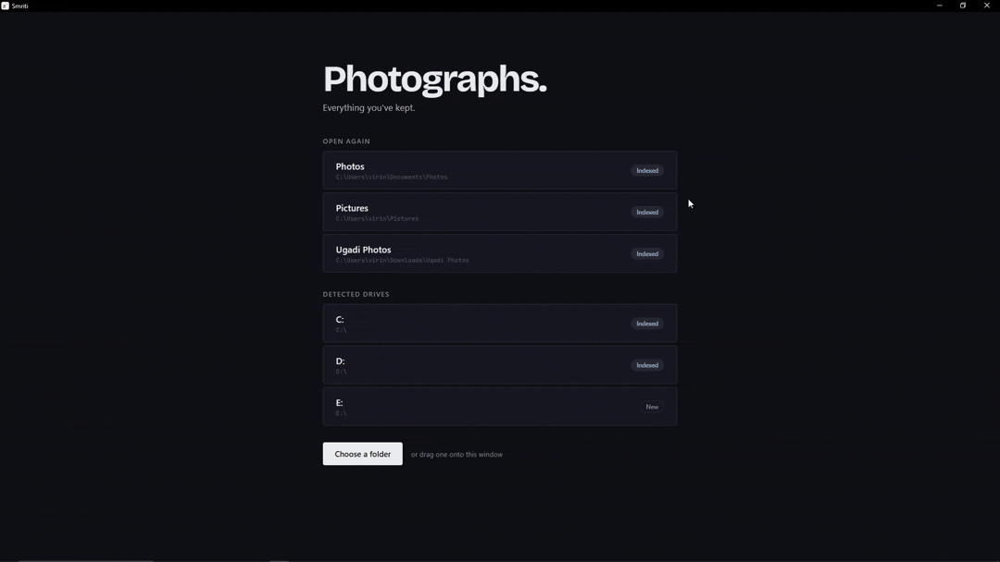
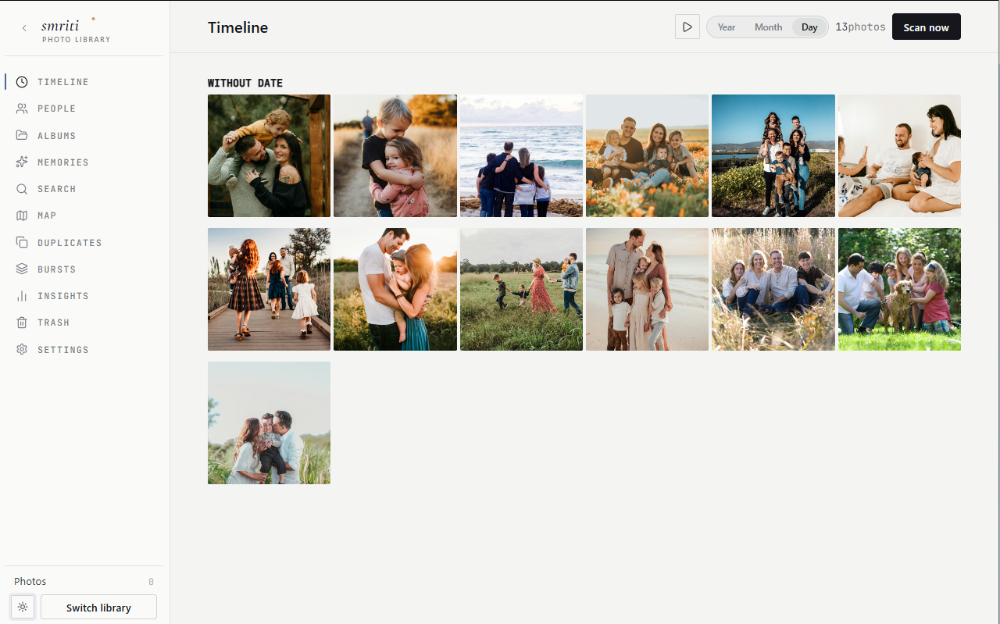
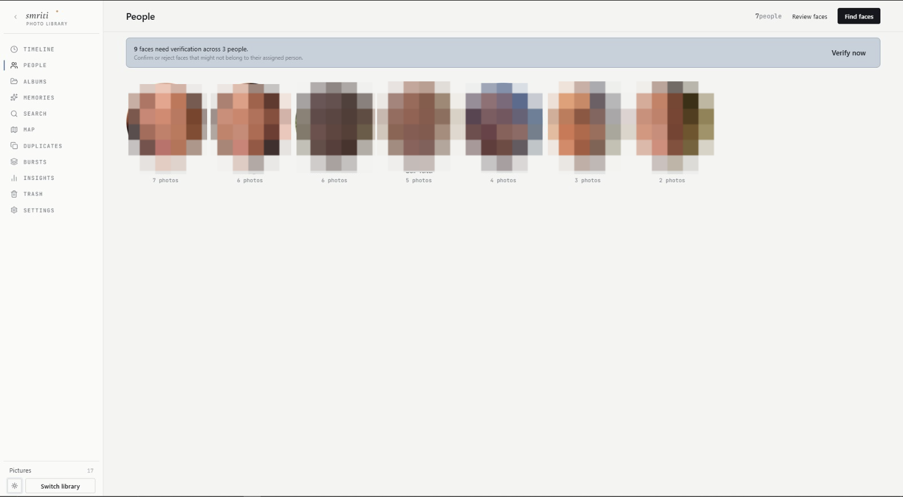
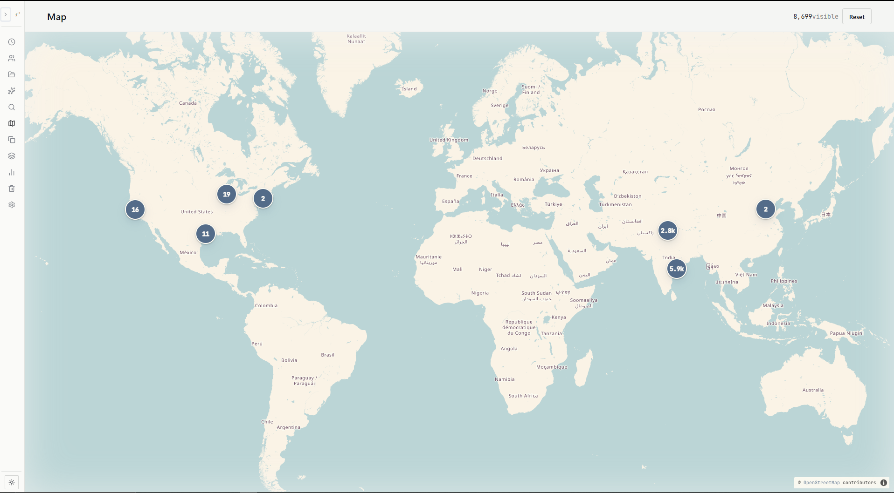

<div align="center">
  <picture>
    <source media="(prefers-color-scheme: dark)" srcset="docs/smriti-logo-dark.svg">
    
  </picture>

  <h2><em>Photos without a server.</em></h2>
  <p><em>स्मृति · Sanskrit for memory.</em></p>

  <p>
    Smriti indexes any drive, recognises faces on-device, and surfaces
    memories — without leaving your machine. No account, no cloud, no
    server humming in a closet.
  </p>

  <p>
    <a href="https://github.com/ChivukulaVirinchi/photovault/releases/latest">
      
    </a>
    <a href="https://github.com/ChivukulaVirinchi/photovault/actions/workflows/ci.yml">
      
    </a>
    <a href="LICENSE">
      
    </a>
    <a href="https://github.com/ChivukulaVirinchi/photovault/releases/latest">
      
    </a>
    <a href="https://github.com/ChivukulaVirinchi/photovault/stargazers">
      
    </a>
    <a href="https://ko-fi.com/L4L11ZM53F">
      
    </a>
  </p>

  <a href="https://chivukulavirinchi.github.io/photovault/">
    
  </a>

  <p>
    <a href="https://github.com/ChivukulaVirinchi/photovault/releases/latest"><strong>Download</strong></a>
    &nbsp;·&nbsp;
    <a href="https://chivukulavirinchi.github.io/photovault/">Website</a>
    &nbsp;·&nbsp;
    <a href="https://chivukulavirinchi.github.io/photovault/docs/">Manual</a>
    &nbsp;·&nbsp;
    <a href="https://github.com/ChivukulaVirinchi/photovault/discussions">Discussions</a>
    &nbsp;·&nbsp;
    <a href="https://ko-fi.com/L4L11ZM53F">Support</a>
  </p>
</div>

---

## Why Smriti exists

Most photo apps want to be a **service**. They want a login, a sync daemon,
a monthly fee, a server you maintain. They want your photos to be content
they process — endlessly, in the background, on a machine that runs all
year so you can check in twice.

Smriti is none of that. Open the app, browse, close it. Your library is
*finished work*, not a stream that needs draining. When the app is closed,
nothing runs. When the app is open, the photos are already where they were —
on your drive, in their folders, exactly as you left them.

## What you do with it

| | |
|---|---|
| **Bring 200,000 photos in.** Point Smriti at a folder or drive. It indexes in place — never copies, never moves your originals. | **Name a face once.** On-device face recognition groups every photo of that person across your whole library. No cloud round-trip. |
| **See where you've actually been.** Every geotagged photo plotted on a map. Click a cluster to drill into a place. Tile cache lives on your drive. | **Find that photo of grandma in 2018.** Unified search across people, albums, places, dates. Three filters, one result. Milliseconds on 250K libraries. |
| **Get reminded, not pestered.** "This day, N years ago" surfaces when you open the app. Never a notification. Never a curated highlight reel. | **Cull the obvious junk.** Duplicates, bursts, near-duplicates surfaced in one place. One-click cleanup. Trash, not delete — restore if you change your mind. |

## See it

<table>
  <tr>
    <td width="33%"><a href="https://chivukulavirinchi.github.io/photovault/"></a></td>
    <td width="33%"><a href="https://chivukulavirinchi.github.io/photovault/"></a></td>
    <td width="33%"><a href="https://chivukulavirinchi.github.io/photovault/"></a></td>
  </tr>
  <tr>
    <td align="center"><sub><strong>Timeline</strong><br>20+ years of photos, sticky year headers, viewport-driven thumbs.</sub></td>
    <td align="center"><sub><strong>People</strong><br>On-device face clustering. Name a face once.</sub></td>
    <td align="center"><sub><strong>Map</strong><br>Every geotagged photo plotted. Click a cluster to drill in.</sub></td>
  </tr>
</table>

## How it compares

|  | Cloud (Google · iCloud) | Self-hosted (Immich · PhotoPrism) | **Smriti** |
|---|---|---|---|
| Photos live | On their servers | On your server | **On the drive they came from** |
| Original quality preserved | Compressed by default (Google's "Storage saver" caps at 16 MP) | Preserved | **Preserved — files are never opened for write** |
| Account required | Yes | Yes (you set one up) | **None** |
| Server to maintain | Theirs (you pay rent) | Yours, 24 / 7 | **None — it's an app** |
| Metadata (faces, tags, albums) | In their database | In your server's database | **On the drive with the photos** |
| Survives provider going away | No | Only if your server keeps running | **Yes — it's files** |
| Yearly attention you owe it | Renew subscription | Updates · certs · backups | **None** |
| Cost over five years | $250 – $750 | NAS + power + your time | **$0** |
| Works on a plane | Limited | Limited (no VPN) | **Everything** |
| Memory footprint when closed | n/a | ~1 – 4 GB resident | **Zero** |

> Smriti writes its database at `<drive>/.photovault/photovault.db` — on the
> same drive as the photos. Unplug the drive, plug it into another computer,
> open Smriti there: same library, same faces, same albums. No sync, no
> upload, no re-indexing.

## Install

All builds are on the **[latest release page](https://github.com/ChivukulaVirinchi/photovault/releases/latest)**. Pick the artifact for your OS — file names follow the standard pattern.

### Windows

- `.msi` installer for Windows 10 / 11.

> Smriti's installer is not code-signed. Windows SmartScreen may warn on
> first launch — click **More info** → **Run anyway**.

### macOS

- `.dmg` or `.tar.gz` archives.

> Smriti is not notarized. Gatekeeper may warn on first launch — right-click
> the app → **Open** → **Open anyway**.

### Linux

- `.deb` for Debian / Ubuntu, `.rpm` for Fedora, `.AppImage` for any other distro (`chmod +x` then run).

Linux artifacts include `SHA256SUMS` for integrity verification. Tagged
releases run build and package checks in CI before publishing.

### Optional assets pack

For **face recognition + offline place names**, click **Set up assets** on
the Welcome screen (or **Download assets** in Settings). Smriti downloads,
validates, and installs the matching `Smriti-Assets.zip` — ONNX Runtime,
face models, and the GeoNames database — in one step.

Smriti runs without it; the asset pack just unlocks those two features.
The app prompts you whenever those assets are missing.

Visual search is a separate optional model install from **Settings ->
Assets**. It is intentionally not bundled into the app or the standard
asset pack because the local text/image encoders are large.

### Automatic updates

Opt-in. Off by default. If enabled, Smriti queries `api.github.com` at most
once every 24 hours. No photo data leaves your machine. See
[PRIVACY.md](PRIVACY.md) for the full disclosure.

If you installed via a system package manager (`apt`, `brew`, `winget`,
`flatpak`), the update banner shows the matching upgrade command rather
than self-replacing the binary.

<details>
<summary><strong>Build from source</strong></summary>

```bash
git clone https://github.com/ChivukulaVirinchi/photovault.git
cd photovault
npm ci --prefix src-ui
./scripts/dev.sh            # Linux / macOS
# .\scripts\dev.ps1         # Windows PowerShell
```

#### HEIC support (optional)

iPhone photos are HEIC. To decode them from a source build, install
`libheif` and rebuild with the `heic` feature:

```bash
# Linux (Debian/Ubuntu)
sudo apt-get install libheif-dev

# macOS
brew install libheif

# then build a production bundle
cd src-tauri
cargo tauri build --features heic
```

Shipped binaries (.deb, AppImage, macOS .tar.gz) include HEIC support
out of the box. The Windows MSI ships without HEIC for now — `libheif`
Windows binaries will land in v1.1. Without HEIC enabled, Smriti still
indexes `.heic` files but reports a clear "HEIC support not compiled in"
error when asked to decode one.

#### Local assets

```bash
./scripts/setup_assets.sh      # Linux / macOS
.\scripts\setup_assets.ps1     # Windows
```

See [`docs/BUILD.md`](docs/BUILD.md) for full setup details including the
WSL + Windows development workflow.

#### Packaging helpers

```bash
./scripts/release_local.sh ubuntu
./scripts/release_local.sh linux-appimage
./scripts/release_local.sh assets-pack
./scripts/release_local.sh verify
```

Windows end-to-end local verification:

```powershell
powershell -ExecutionPolicy Bypass -File scripts\release_local.ps1 -Mode full
```

The official release flow is CI-driven from git tags (`v*`) via
[`.github/workflows/release.yml`](.github/workflows/release.yml).

</details>

## Privacy at a glance

Smriti makes **exactly four kinds of HTTP request**. Three of them you can
turn off. Nothing else leaves your machine — ever. No telemetry, no
analytics, no "anonymous usage statistics."

1. **Map tiles** when you open the Map view (`tile.openstreetmap.org`). Cached locally.
2. **Asset pack download** (`github.com/.../releases`), one-time, opt-in.
3. **Update check** (`api.github.com`), opt-in — **off by default**.
4. **Update install** (`github.com/.../releases/download/...`), only when you click Download.

Full disclosure: [PRIVACY.md](PRIVACY.md).

## Documentation

Full user guide and contributor docs are published at
**[chivukulavirinchi.github.io/photovault](https://chivukulavirinchi.github.io/photovault/)**.

- [Getting Started](https://chivukulavirinchi.github.io/photovault/docs/user-guide/getting-started.html)
- [Indexing Photos](https://chivukulavirinchi.github.io/photovault/docs/user-guide/indexing.html)
- [People and Faces](https://chivukulavirinchi.github.io/photovault/docs/user-guide/people.html)
- [Build Guide](docs/BUILD.md)
- [Architecture Overview](docs/architecture/overview.md)
- [API Reference (rustdoc)](https://chivukulavirinchi.github.io/photovault/api/)

## Community

- **[GitHub Discussions](https://github.com/ChivukulaVirinchi/photovault/discussions)** — questions, feature ideas, show-and-tell.
- **[Issues](https://github.com/ChivukulaVirinchi/photovault/issues)** — bug reports and feature requests, via the templates.
- **[CONTRIBUTING.md](CONTRIBUTING.md)** — dev setup, commit style, CI gates, architectural rules.
- **[Security advisories](https://github.com/ChivukulaVirinchi/photovault/security/advisories/new)** — private reporting path for vulnerabilities (see [SECURITY.md](SECURITY.md)).

## Support

Smriti is free and Apache-2.0 licensed. If it's useful to you, a
small contribution helps keep it maintained:

[](https://github.com/sponsors/ChivukulaVirinchi)
&nbsp;
[](https://ko-fi.com/L4L11ZM53F)

> **Note on face-recognition models.** The face detection + recognition
> models come from [InsightFace](https://github.com/deepinsight/insightface)
> and are downloaded from the upstream project on first run, not bundled
> in the installer. See [THIRD_PARTY_LICENSES.md](THIRD_PARTY_LICENSES.md)
> for attributions.

## Built with

- [Rust](https://www.rust-lang.org/) — the engine: services, DB, ML, indexing
- [Tauri 2](https://tauri.app/) — native desktop shell (Linux / Windows / macOS)
- [Svelte 5](https://svelte.dev/) + [Vite](https://vitejs.dev/) — frontend
- [SQLite](https://sqlite.org/) — embedded per-drive database
- [ONNX Runtime](https://onnxruntime.ai/) — on-device face detection + recognition
- [MapLibre GL](https://maplibre.org/) — interactive map view
- [GeoNames](https://www.geonames.org/) — offline reverse geocoding
- [OpenStreetMap](https://www.openstreetmap.org/) — map tiles

## License

[Apache License 2.0](LICENSE). See
[THIRD_PARTY_LICENSES.md](THIRD_PARTY_LICENSES.md) for the full
third-party attribution list.
