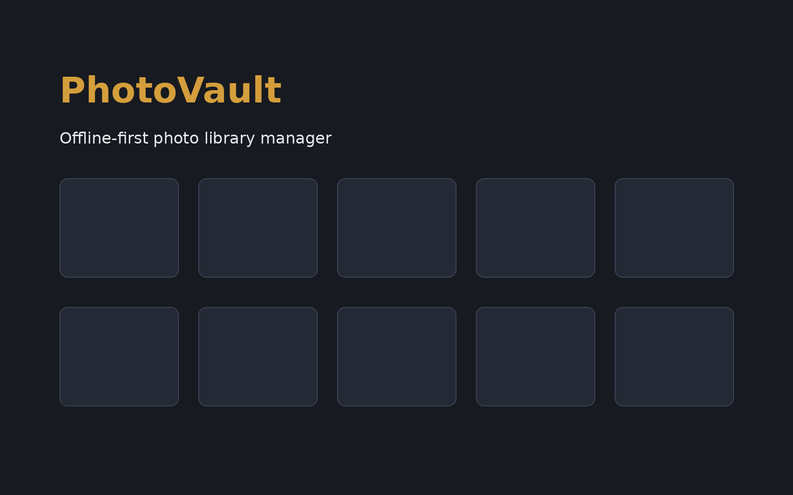

<div align="center">
  <h1>PhotoVault</h1>
  <p><strong>An offline-first desktop photo library manager.</strong></p>
  <p>
    Organize, search, and rediscover your photos.
    Works with photos on your local drives. No cloud, no telemetry, no account required.
  </p>

  <p>
    <a href="https://github.com/ChivukulaVirinchi/photovault/releases/latest">
      
    </a>
    <a href="LICENSE">
      
    </a>
  </p>

  
</div>

---

## What it does

- **Indexes photos** from any folder or external drive -- no upload required
- **Recognizes faces** using on-device ML, groups photos by person
- **Suggests albums** for trips and events automatically
- **Surfaces memories** -- "N years ago today" rediscovery
- **Visualizes geography** -- interactive map of where photos were taken
- **Shows insights** -- heatmaps, top people, top locations, monthly breakdown
- **Finds anything** -- unified search across people, albums, places, photos

## Why offline?

Your photos are personal. PhotoVault keeps them that way.

- No cloud upload. Photos stay on your drive.
- No account required. No telemetry. No analytics.
- Works without internet after optional assets are installed.
- Database lives on the indexed drive -- fully portable.

## Install

### Linux
- **Debian/Ubuntu installer**: [Download .deb](https://github.com/ChivukulaVirinchi/photovault/releases/latest/download/PhotoVault-ubuntu-amd64.deb)
- **AppImage (other distros)**: [Download AppImage](https://github.com/ChivukulaVirinchi/photovault/releases/latest/download/PhotoVault-x86_64.AppImage) -> `chmod +x` -> run
- **Optional assets pack**: [Download PhotoVault-Assets.zip](https://github.com/ChivukulaVirinchi/photovault/releases/latest/download/PhotoVault-Assets.zip)

### Linux notes
- `.rpm` is not produced by the current CI workflow yet.
- Linux release artifacts include `SHA256SUMS` for integrity verification.
- Tagged releases also run Linux package smoke tests in CI (`.deb` and AppImage startup checks).

### Windows
- **Recommended**: [Download MSI installer](https://github.com/ChivukulaVirinchi/photovault/releases/latest/download/PhotoVault-Setup-x64.msi)
- **Portable fallback**: [Download ZIP](https://github.com/ChivukulaVirinchi/photovault/releases/latest/download/photovault-x86_64-pc-windows-msvc.zip)
- **Optional assets pack**: [Download PhotoVault-Assets.zip](https://github.com/ChivukulaVirinchi/photovault/releases/latest/download/PhotoVault-Assets.zip)
- Windows SmartScreen may warn -- click "More info" -> "Run anyway"
  (No code-signing certificate yet)

### macOS
- Download the macOS archive from the [releases page](https://github.com/ChivukulaVirinchi/photovault/releases/latest)
- Optional assets pack (for face recognition + geocoding): [PhotoVault-Assets.zip](https://github.com/ChivukulaVirinchi/photovault/releases/latest/download/PhotoVault-Assets.zip)
- macOS Gatekeeper may warn -- right-click -> "Open" -> "Open anyway"
  (No Apple Developer ID yet)

## Build from source

```bash
git clone https://github.com/ChivukulaVirinchi/photovault.git
cd photovault
cargo build --release
./target/release/photovault
```

Optional (preinstall assets manually):

```bash
./scripts/setup_assets.sh
```

See `docs/BUILD.md` for full setup including Windows-on-UNC workflow.

### Packaging helpers

For local packaging smoke tests:

```bash
./scripts/release_local.sh ubuntu
./scripts/release_local.sh linux-appimage
./scripts/release_local.sh assets-pack
./scripts/release_local.sh verify
```

Windows end-to-end local verification and release orchestration:

```powershell
powershell -ExecutionPolicy Bypass -File scripts\release_local.ps1 -Mode full
powershell -ExecutionPolicy Bypass -File scripts\release_publish.ps1 -Version v0.1.0-rc3 -RunLocalChecks -Wait
```

`release_publish.ps1` intentionally stops at a **draft** GitHub release (manual publish remains your decision).

Windows/macOS installers should be built on their native platforms. The official
release flow is CI-driven from Git tags (`v*`) via `.github/workflows/release.yml`.

## Documentation

- [Build Guide](docs/BUILD.md)
- [Future Scope](docs/FUTURE_SCOPE.md)
- [Face Recognition Improvements](docs/FACE_RECOGNITION_IMPROVEMENTS.md)

## Contributing

Contributions are welcome. See [CONTRIBUTING.md](CONTRIBUTING.md) for
dev setup, testing, and pull request guidelines.

## License

[Apache License 2.0](LICENSE)

## Built with

- [Rust](https://www.rust-lang.org/)
- [iced](https://iced.rs/) -- cross-platform GUI
- [SQLite](https://sqlite.org/) -- embedded database
- [ONNX Runtime](https://onnxruntime.ai/) -- face detection/recognition
- [GeoNames](https://www.geonames.org/) -- offline reverse geocoding
- [OpenStreetMap](https://www.openstreetmap.org/) -- map tiles
